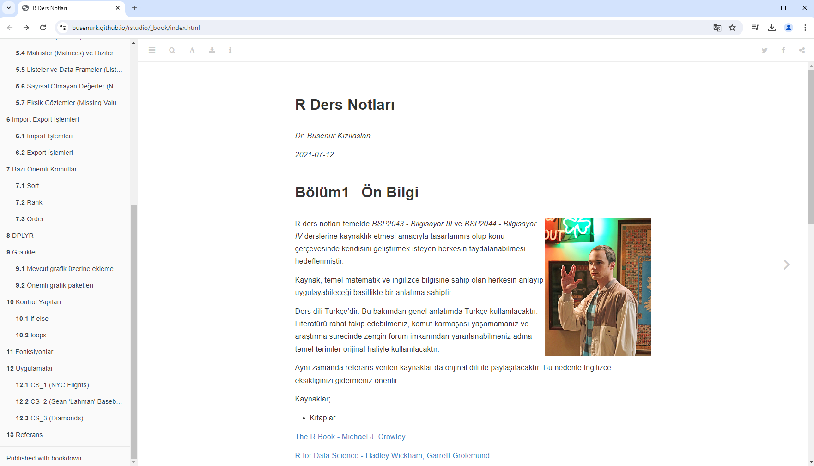
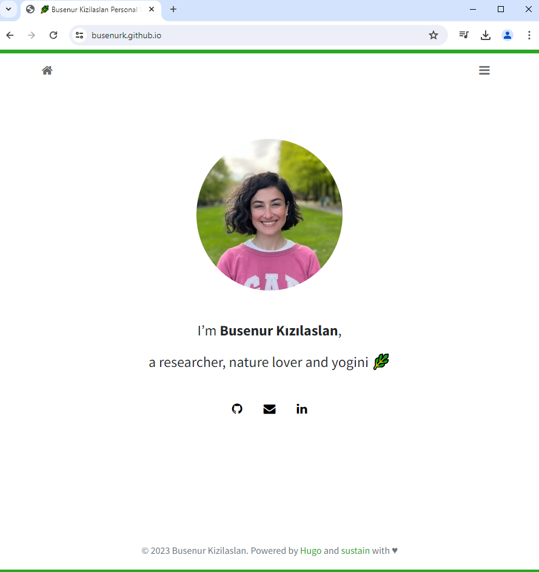
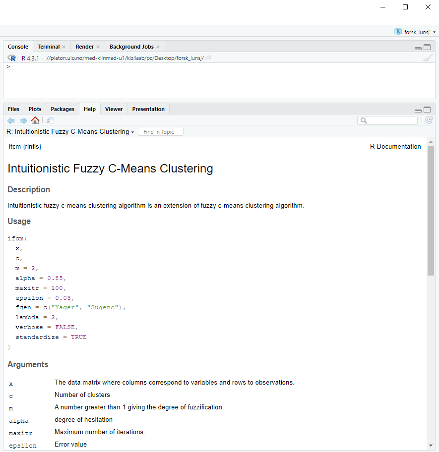
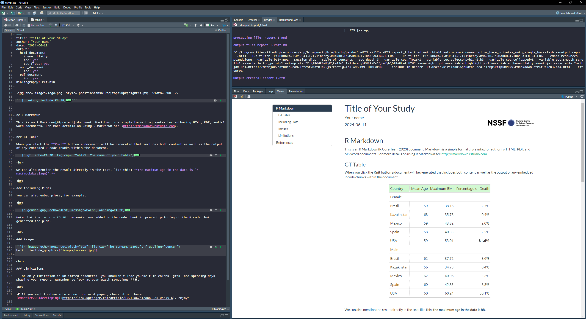

```{r setup, include=FALSE}
options(htmltools.dir.version = FALSE)
episode_counter <- 0
knitr::opts_chunk$set(
	message = FALSE,
	warning = FALSE,
	collapse = TRUE,
	comment = "#>"
)
```

```{r packages, include=FALSE}
library(countdown)
library(ymlthis)
library(tidyverse)
library(arsenal)
library(janitor)
library(scico)
library(cowplot)

# install.packages("devtools")
devtools::install_github("hadley/emo")
ggplot2::theme_set(ggplot2::theme_minimal())

mockdata <- read_csv(here::here("mockpaper/data/mockdata.csv")) %>% 
  mutate_at(vars(starts_with("ae_")), ~as.factor(.)) %>% 
  mutate(fu_fct = fct_recode(as.factor(fu_stat), 
                             "Lived" = "1", 
                             "Died" = "2")) %>% 
  filter(!site == "Nur-Sultan") 
```


class: title-slide, right, bottom
background-image: url(images/main2.jpg)


# An Introduction to R Markdown

### Busenur KIZILASLAN, PhD 

---

<br>

.pull-left[

```{r echo=FALSE, out.width="250%", fig.align='center'}
knitr::include_graphics("images/commun.png")
```
]

.pull-right[

<br>

<br>

<br>

Slides by: <https://www.apreshill.com/>

<br>

Artworks by: <https://allisonhorst.com/>
]
---
class: bottom center
background-image: url(images/projs.png)
background-position: 50% 10%
background-size: 70%

## .big-text[Write. Code. Share. Repeat.]

---
class: top, center
background-image: url(images/rmd_flowchart.png)
background-position: 50% 50%
background-size: 100%

# How it works

---
class: top center
background-image: url(images/fauna.png)
background-position: 50% 90%
background-size: 50%

# Who uses it?

--

.pull-left[
.center[
Researchers
]
]

--

.pull-right[
.center[
Data Scientists
]
]


---
class: middle
background-image: url(images/knit.png)
background-position: 90% 50%
background-size: 25%

# How do they use it?

--

+ Scientific communication 


--

+ Team collaboration

--

+ Teaching (& learning) out loud


---
layout: true

<div class="my-footer"><span>Faglunsj, NSSF, 2024</span></div>

---
class: inverse, middle, center

# What is R Markdown?

---

# What is R Markdown?

--

1. An authoring framework for data science.

--

1. A document format (`.Rmd`).

--

1. An R package named `rmarkdown`.

--

1. A file format for making dynamic documents with R. 

--

1. A tool for integrating text, code, and results.

--

1. A computational document.

--

1. Wizardry.

---
class: middle, center

# What is inside?


---
name: card0
background-image: url(images/card0.png)
background-size: contain

.footnote[https://www.dear-data.com/]

---
name: card1
background-image: url(images/card1.png)
background-size: contain

.footnote[https://www.dear-data.com/]

---
class: middle, center

# Output options

---

# Save output options in your YAML

.pull-left[

```{r echo = FALSE}
yml_empty() %>% 
 yml_author("Your name here") %>% 
  yml_title("Your title here") %>% 
  yml_output(html_document()) %>% 
  asis_yaml_output()
```

```{r echo = FALSE}
yml_empty() %>% 
  yml_author("Your name here") %>% 
  yml_title("Your title here") %>% 
  yml_output(html_document(toc = TRUE,
                           toc_float = TRUE,
                           theme = "flatly")) %>% 
  asis_yaml_output()
```


]

.pull-right[

```{r echo=FALSE, out.width="75%", fig.align='center'}
knitr::include_graphics("images/orchestra.jpg")
```

]

---
background-image: url(images/Single-rmd.png)
background-size: contain

---
background-image: url(images/Single-rmd1.png)
background-size: contain

---
background-image: url(images/Single-rmd2.png)
background-size: contain

---
background-image: url(images/Single-rmd3.png)
background-size: contain

---
class: top center

<video width="1530" height="610" controls>
    <source src="images/single-doc-knit.mp4" type="video/mp4"> </video>

---
class: middle center
background-image: url(images/Single-knit1.png)
background-size: contain

???

Here is what we knit. 

--


???

Using the `THEME:` key in our YAML, we changed our font and colors.

--


???

And we have this nice table of contents floating off to the side...

---
class: middle, center

# Output formats


---
class: middle, center


```{r echo=FALSE, out.width="50%", fig.link="https://rmarkdown.rstudio.com/docs/reference/index.html#section-output-formats"}
knitr::include_graphics("images/rmdbase-formats.png")
```

---

# `r emo::ji("yarn")` Knit

.pull-left[
```{r echo=FALSE, out.width="60%", fig.align="center"}
knitr::include_graphics("images/knit-dropdown.png")
```

]

.pull-right[

```{r echo=FALSE}
yml_empty() %>% 
  yml_author("Your name here") %>% 
  yml_title("Your title here") %>% 
  yml_output(html_document(toc = TRUE, toc_float = TRUE, theme = "flatly"), 
             word_document(), 
             pdf_document()
             )  %>% 
  asis_yaml_output()
```
]

???

This is a great way to "control" your knit button!

Notice that when you knit, it respects those output options in your YAML.

This way you "save" your output options

---
class: middle, center
# Built-in output formats


```{r echo=FALSE, out.width="32%"}
knitr::include_graphics("https://raw.githubusercontent.com/rstudio/hex-stickers/master/PNG/rmarkdown.png")
```

---
class: middle, center

```{r echo=FALSE,out.width="50%"}
knitr::include_graphics("images/outputs.png")
```

???

Built in formats (in the `rmarkdown` package)

versus

extensions (different packages that extend output formats available to you)

---
class: middle, center

# Extension output formats


```{r echo=FALSE, out.width="32%"}
knitr::include_graphics("https://raw.githubusercontent.com/rstudio/hex-stickers/master/PNG/flexdashboard.png")

knitr::include_graphics("https://raw.githubusercontent.com/rstudio/hex-stickers/master/PNG/bookdown.png")

knitr::include_graphics("https://raw.githubusercontent.com/rstudio/hex-stickers/master/PNG/xaringan.png")
```

---

template: card0

---
template: card1

---
name: card2
background-image: url(images/card2.png)
background-size: contain

.footnote[https://www.dear-data.com/]

---

# <center>Headers</center>

--

.pull-left[
```markdown
# HEADER 1

## HEADER 2

### HEADER 3

#### HEADER 4

##### HEADER 5

###### HEADER 6
```
]

--

.pull-right[
# HEADER 1

## HEADER 2

### HEADER 3

#### HEADER 4

##### HEADER 5

###### HEADER 6
]

---


---

<br>

# <center>Text</center>

--

.pull-left[
```markdown
Why do programmers prefer **dark mode**? 
Because the light attracts _bugs_!
```

<br>

```{r echo=FALSE, out.width="75%", fig.align='center'}
knitr::include_graphics("https://i.giphy.com/media/v1.Y2lkPTc5MGI3NjExeXlyeXpwYWxpNGQyY2NteWo5ZGtpajZzdDB4NTU0NXlxOGx5dGNxcSZlcD12MV9pbnRlcm5hbF9naWZfYnlfaWQmY3Q9Zw/ZqlvCTNHpqrio/giphy.gif")
```
]

--

.pull-right[
Why do programmers prefer **dark mode**? 
Because the light attracts _bugs_!
]

---

<br>

# <center>Text</center>

--

<br>

.pull-left[
```markdown
In Norway, we ~~freeze~~ fix bugs
in our code quickly. 
```
]

--

.pull-right[
In Norway, we ~~freeze~~ fix bugs
in our code quickly. 

]

---
class: top

# <center>Lists</center>

--

.pull-left[

```markdown
Indeed, parents whose children are  
vaccinated no longer have to worry about  
their child's death or disability from:

- whooping cough, 
- polio, 
- diphtheria, 
- hepatitis, or 
- a host of other infections.

Vaccines are the most cost-effective health  
care interventions there are. We have   
three new, extremely effective vaccines to  
roll out in developing countries:  

1. pneumonia
1. rotavirus
1. meningitis A
```

]

--

.pull-right[

Indeed, parents whose children are  
vaccinated no longer have to worry about  
their child's death or disability from:

- whooping cough, 
- polio, 
- diphtheria, 
- hepatitis, or 
- a host of other infections.

Vaccines are the most cost-effective health  
care interventions there are. We have  
three new, extremely effective vaccines to  
roll out in developing countries:

1. pneumonia
1. rotavirus
1. meningitis A

]

---

# <center>Images</center>

```{r echo=TRUE, out.width="50%"}
# It's Alive
knitr::include_graphics("images/doc-live.jpg")
```


---

# <center>Images</center>

```{r echo=TRUE, out.width="30%"}
# The Scream, 1893.
knitr::include_graphics("http://bit.ly/munchNO")
```

---

# <center>Links</center>

--

```markdown
[The Scream](https://en.wikipedia.org/wiki/The_Scream)
```

[The Scream](http://bit.ly/munchNO)

--

<br>

# <center>Equations</center>

.pull-left[
```markdown
$\sum_{i = 1}^{n}(y_{i}-\hat{y})^2$
```]


.pull-right[
$\sum_{i = 1}^{n}(y_{i}-\hat{y})^2$
]


---
template: card0

---
template: card1

---
template: card2

---
name: card3
background-image: url(images/card3.png)
background-size: contain

---
class: middle, center, inverse

# `code` -> plots

---

# Including plots

.pull-left[
```{r age-hist-print, fig.show='hide'}
# PLOT: Age distribution -------------------------------------------------------
age_histogram <- 
  ggplot(mockdata, aes(age)) +
  geom_histogram(color = 'white',
                 fill = scico(1, 
                              begin = .3, 
                              palette = "berlin"),
                 bins = 20) +
  labs(x = "Age", 
       y = "Count") +
  scale_y_continuous(
    breaks = scales::pretty_breaks()
  )
age_histogram
```

]

--

.pull-right[
```{r ref.label='age-hist-print', echo=FALSE, fig.retina=3}
```

]

???


so, how did we get a figure into R Markdown?

Answer: it has to print!

---

# Plotly

```{r gender_gap, echo=FALSE, message=FALSE, warning=FALSE, out.width="90%", out.height= "55%"}
library(plotly)

data <- read.csv("https://raw.githubusercontent.com/plotly/datasets/master/school_earnings.csv")

data$State <- as.factor(c('Massachusetts', 'California', 'Massachusetts', 'Pennsylvania', 'New Jersey', 'Illinois', 'Washington DC',
                          'Massachusetts', 'Connecticut', 'New York', 'North Carolina', 'New Hampshire', 'New York', 'Indiana',
                          'New York', 'Michigan', 'Rhode Island', 'California', 'Georgia', 'California', 'California'))

gender_gap <- plot_ly(data, x = ~Women, y = ~Men, text = ~School, type = 'scatter', mode = 'markers', size = ~Gap, color = ~State, colors = 'Paired',
        #Choosing the range of the bubbles' sizes:
        sizes = c(10, 50),
        marker = list(opacity = 0.5, sizemode = 'diameter'))
gender_gap <- gender_gap %>% layout(title = 'Gender Gap in Earnings per University',
         xaxis = list(showgrid = FALSE),
         yaxis = list(showgrid = FALSE),
         showlegend = FALSE)

gender_gap
```

<br>

**plotly** is an R package for creating interactive web-based graphs via the open source JavaScript graphing library plotly.js

---

# Plotly

```{r echo=FALSE, message=FALSE, warning=FALSE, fig.align='center', out.width="90%", out.height= "55%"}
fig2 <- plot_ly(x = ~rnorm(50), type = "box")
fig2 <- fig2 %>% add_trace(x = ~rnorm(50, 1))
fig2 <- fig2 %>% add_trace(z = ~rnorm(70, 255))
fig2 <- fig2 %>% add_trace(t = ~rnorm(10, 0,1))
fig2 <- fig2 %>% add_trace(k = ~rnorm(5, 10, 1))


fig2
```


---
class: middle, center

# Chunk options for plots

---

# out.width

.pull-left[

````
```{r out.width="70%"}`r ''`
age_histogram
```
````

```{r ref.label='age-hist-print', echo=FALSE, out.width="70%", fig.retina=3}
```
]

--

.pull-right[

````
```{r out.width="10%"}`r ''`
age_histogram
```
````

```{r ref.label='age-hist-print', echo=FALSE, fig.retina=3, out.width="10%"}

```

See also:

+ `fig.width`
+ `fig.height` 
+ `fig.asp`

https://r4ds.had.co.nz/graphics-for-communication.html#figure-sizing

]

---

# Chunk labels

.pull-left[

````
```{r peek}`r ''`
glimpse(mockdata)
```
````

]

.pull-right[

+ Place between curly braces<br>`{r label}`

+ Separated options with commas<br>`{r label, option1=value}`

+ Careful! No duplicate chunk labels

    ````
    ```{r peek}`r ''`
    head(mockdata)
    ```
    ````

    ```
    Error in parse_block(g[-1], g[1], params.src) : 
      duplicate label 'peek'
    Calls: <Anonymous> ... process_file -> split_file -> lapply -> FUN -> parse_block
    Execution halted
    ```

]

???

how can we make it easier on ourselves to explore the code in here?

show how to add chunk labels and view in IDE interactively

---
class: top, center
background-image: url(images/plants.jpg)
background-size: 70%
background-color: #fff5ec

# Chunks as crops or houseplants?

.footnote[https://masalmon.eu/2017/08/08/chunkpets/]

---
class: middle, center

# A good chunk label

.pull-left[

### Good

`my-plot`

`myplot`

`myplot1`

`myplot-1`

`MY-PLOT`

]

.pull-right[

### Bad

`my_plot`

`my plot`

everything else!

]

---
class: middle, center

# A good chunk label

Think: kebabs, not snakes


---
background-image: url(images/pour.jpg)
background-position: left
background-size: contain
class: middle, center

.pull-right[

]

---

# fig.cap

````
```{r age-plot, echo=FALSE, fig.cap='Age distributions'}`r ''`
age_histogram
```
````

.center[

```{r age-plot, out.width='25%', echo = FALSE, fig.retina = 3}
age_histogram
```

**Fig. 1:** Age distributions

]

---

# Cross-reference a figure

.pull-left[

See Figure `\@ref(fig:age-plot)`.

````
```{r age-plot, echo=FALSE, fig.cap='Age distributions'}`r ''`
age_histogram
```
````

]

.pull-right[

See Figure [1]().

.center[

```{r ref.label = 'age-plot', out.width='70%', echo = FALSE, fig.retina = 3, fig.cap='Age distributions'}
```

]

]

.footnote[Cross-referencing only works in these output packages: distill, bookdown, blogdown]

---

# Key takeaway

Once you have:

`r emo::ji("heavy_check_mark")` A labeled chunk that produces a plot

`r emo::ji("heavy_check_mark")` A figure caption using `fig.cap`

Then you can have:

### Cross-references!*

.footnote[\* and you are using distill, bookdown, or blogdown output formats]


---

# message / warning


---

# message / warning

.pull-left[

````
```{r message=FALSE, warning=FALSE}`r ''`
library(tidyverse)
```
````

]

.pull-right[

```{r message=FALSE, warning=FALSE}
library(tidyverse)
```

]

---
class: middle, center

# Other useful chunk options

---

# echo

.pull-left[

````
```{r echo=FALSE}`r ''`
glimpse(mockdata)
```
````

]

.pull-right[

```{r echo=FALSE}
glimpse(mockdata)
```

]

---

# eval

.pull-left[

````
```{r eval=FALSE}`r ''`
glimpse(mockdata)
```
````

]

.pull-right[

```{r eval=FALSE}
glimpse(mockdata)
```

]

---

# include

.pull-left[

````
```{r include=FALSE}`r ''`
glimpse(mockdata)
```
````

]

.pull-right[

```{r include=FALSE}
glimpse(mockdata)
```

]

---

# A global `setup` chunk `r emo::ji("earth_africa")`

One chunk to rule them all

.pull-left[

````
```{r setup, include = FALSE}`r ''`
knitr::opts_chunk$set(
  warning = FALSE,
  message = FALSE,
  echo = FALSE,
  fig.path = "alison-figs/"
)
```
````

]

.pull-right[

+ A special chunk label: `setup`

+ Typically the first chunk

+ All following chunks will use these options (i.e., sets global chunk options)

+ **Tip**: set `include=FALSE`

+ You can (and should) use individual chunk options too

]


---

.left-column[
# Default options
]

.right-column[
```{r}
str(knitr::opts_chunk$get())
```

]

---

# Bonus

```{r echo=TRUE}
x <- 3 + 5
```

```markdown
No output
```

--

<br>

```{r echo=TRUE}
x <- 3 + 5
x
```

<br>

--

.pull-left[

```markdown
We can mention the value directly as 'r x'.
```

]

.pull-right[
We can mention the value directly as `r x`.
]

---
template: card0

---
template: card1

---
template: card2

---
template: card3

---
background-image: url(images/card4.png)
background-size: contain


---
class: center
background-image: url(images/typewriter.jpg)
background-size: contain
background-color: #f6f6f6

# Markdown tables

---
class: center

# Markdown tables

.pull-left[

```markdown
| Time          | Session | Topic    |
|:--------------|:-------:|---------:|
| _left_        | _center_| _right_  |
| 01:00 - 01:50 | 1       | Anatomy  |
| 01:50 - 02:00 |         | *Break*  |
| 02:00 - 02:45 | 2       | Tables   |
| 02:45 - 03:00 |         | *Break*  |

```
]

--

.pull-right[

| Time          | Session | Topic    |
|:--------------|:-------:|---------:|
| _left_        | _center_| _right_  |
| 01:00 - 01:50 | 1       | Anatomy  |
| 01:50 - 02:00 |         | *Break*  |
| 02:00 - 02:45 | 2       | Tables   |
| 02:45 - 03:00 |         | *Break*  |

]


---

# Let's try using data now

```{r }
head(mockdata)
```

---
class: middle

.left-column[

```{r out.width='50%', echo=FALSE}
knitr::include_graphics("https://raw.githubusercontent.com/rstudio/gt/master/man/figures/logo.svg")
```

]

.right-column[
# the gt package

<https://gt.rstudio.com/>
]

---
background-image: url(https://gt.rstudio.com/reference/figures/gt_parts_of_a_table.svg)
background-size: contain

---
background-image: url(https://gt.rstudio.com/reference/figures/gt_workflow_diagram.svg)
background-size: contain

---

# GT Table

````
```{r }`r ''`
mockdata %>% 
  select(country, sex, age, bmi, fu_fct) %>% 
  group_by(sex, country) %>% 
  summarise(mean_age = mean(age), 
            max_bmi = max(bmi, na.rm = T),
            death = sum(fu_fct == 'Died')) 
```
````

```{r echo=FALSE}
library(gt)
mockdata %>% 
  select(country, sex, age, bmi, fu_fct) %>% 
  group_by(sex, country) %>% 
  summarise(mean_age = mean(age), 
            max_bmi = max(bmi, na.rm = T),
            death = sum(fu_fct == 'Died')) 

```


---

# GT Table

.pull-left[

````
```{r }`r ''`
mockdata %>% 
  select(country, sex, age, bmi, fu_fct) %>% 
  group_by(sex, country) %>% 
  summarise(mean_age = mean(age), 
            max_bmi = max(bmi, na.rm = T),
            death = sum(fu_fct == 'Died')) %>% 
  gt()
```
````
]

--

.pull-right[
```{r echo=FALSE}
library(gt)
mockdata %>% 
  select(country, sex, age, bmi, fu_fct) %>% 
  group_by(sex, country) %>% 
  summarise(mean_age = mean(age), 
            max_bmi = max(bmi, na.rm = T),
            death = sum(fu_fct == 'Died')) %>% 
  gt::gt()

```
]

---

# GT Table

.pull-left[

````
```{r }`r ''`
library(gtExtras)
mockdata %>% 
  select(country, sex, age, bmi, fu_fct) %>% 
  group_by(sex, country) %>% 
  summarise(mean_age = round(mean(age),0), 
            max_bmi = round(max(bmi, na.rm = T),2), 
            death = sum(fu_fct == 'Died')/1356) %>% 
  gt::gt() %>% 
  gtExtras::gt_add_divider(columns = c('country', 'max_bmi'), 
                           weight = px(2), color = '#d7d6d7', 
                           style = 'dotted') %>% 
  fmt_percent( columns = c('death'), decimals = 1) %>% 
  cols_label(country = 'Country', mean_age = 'Mean Age', 
             max_bmi = 'Maximum BMI', death = 'Percentage of Death') %>% 
  tab_options(column_labels.background.color = '#dbf0fa') %>% 
  tab_style(style = list(cell_text(weight = 'bold')), 
            locations = cells_body(columns = 5, rows = 5)) 
```
````
]


.pull-right[
```{r echo=FALSE, message=FALSE, warning=FALSE}
library(gtExtras)
mockdata %>% 
  select(country, sex, age, bmi, fu_fct) %>% 
  group_by(sex, country) %>% 
  summarise(mean_age = round(mean(age),0), 
            max_bmi = round(max(bmi, na.rm = T),2), 
            death = sum(fu_fct == 'Died')/1356) %>% 
  gt::gt() %>% 
  gtExtras::gt_add_divider(columns = c('country', 'max_bmi'), 
                           weight = px(2), color = '#d7d6d7', 
                           style = 'dotted') %>% 
  fmt_percent( columns = c('death'), decimals = 1) %>% 
  cols_label(country = 'Country', mean_age = 'Mean Age', 
             max_bmi = 'Maximum BMI', death = 'Percentage of Death') %>% 
  tab_options(column_labels.background.color = '#dbf0fa') %>% 
  tab_style(style = list(cell_text(weight = 'bold')), 
            locations = cells_body(columns = 5, rows = 5))  %>% 
  cols_align(align = 'center', columns = 3:5)
  
```

]


---
class: middle

.left-column[


]

.right-column[
# the gtsummary package

<http://www.danieldsjoberg.com/gtsummary/index.html>
]

---
class: middle

.left-column[
```{r sum-tbl, results='hide', warning=FALSE, message=FALSE, out.width='70%'}
library(gtsummary)
mockdata %>% 
  select(country, sex, age, bmi, fu_fct) %>% 
  tbl_summary(by = sex) %>% 
  add_p() %>% 
  add_overall()
```
]

.right-column[
```{r ref.label='sum-tbl', echo=FALSE}

```

]


---
class: middle, center

# Take-aways

--

`r emo::ji("heavy_check_mark")` **Document your document:** use YAML to set up meaningful metadata

--

`r emo::ji("heavy_check_mark")` **Style your document:** use YAML to add options to your chosen output format

--

`r emo::ji("heavy_check_mark")` **Organize your text:** use markdown headers with `#`

--

`r emo::ji("heavy_check_mark")` **Organize your code:** use `knitr` chunk labels

--

`r emo::ji("heavy_check_mark")` **Style your text:** use markdown **bold**, _italics_, <i class="fas fa-list-ul"></i> bullets, and <i class="fas fa-list-ol"></i> lists

--

`r emo::ji("heavy_check_mark")` **Style your output:** use `knitr` chunk options

--

`r emo::ji("yarn")` early, `r emo::ji("yarn")` often


---
class: top

# How does R Markdown work?

1. `r emo::ji("shrug")`

1. I press knit, a document appears, and I believe that anything happening in between could be actual magic.

1. `knitr` executes the code and converts `.Rmd` to `.md`; **Pandoc** renders the `.md` file to the output format you want.

---
class: top

# How *does* R Markdown work?

1. `r emo::ji("shrug")` (`r emo::ji("heavy_check_mark")`)

1. ["I press knit, a document appears, and I believe that anything happening in between could be actual magic."](https://twitter.com/allison_horst/status/1070323369600442368?s=20) (`r emo::ji("wizard")`)

1. `knitr` executes the code and converts `.Rmd` to `.md`; **Pandoc** renders the `.md` file to the output format you want. (`r emo::ji("heavy_check_mark")`)


---
class: middle, center

```{r echo = FALSE, out.width="25%", fig.align="center"}
knitr::include_graphics("https://raw.githubusercontent.com/rstudio/hex-stickers/master/PNG/rmarkdown.png")
```


> "In a nutshell, R Markdown stands on the shoulders of `knitr` and **Pandoc**.

--

> The former executes the computer code embedded in Markdown, and converts R Markdown to Markdown.

--

> The latter renders Markdown to the output format you want (such as PDF, HTML, Word, and so on)."

--

> &mdash; [R Markdown: The Definitive Guide](https://bookdown.org/yihui/rmarkdown/)

---

class: center, middle

# R projects

```{r echo=FALSE}
knitr::include_graphics("images/rproj.png")
```


---
class: middle, center

.pull-left[
# <i class="fas fa-mouse-pointer"></i>

_File > New Project..._
```{r, echo = FALSE}
knitr::include_graphics("images/rstudio-new.png")
```
]
--

.pull-right[
# <i class="fas fa-mouse-pointer"></i>

Pick one
```{r, echo = FALSE}
knitr::include_graphics("images/rstudio-newproj.png")
```
]

---
class: middle, center

.pull-left[
# <i class="fas fa-mouse-pointer"></i>

_File > New File > R Markdown..._
```{r, echo = FALSE}
knitr::include_graphics("images/rstudio-newfile.png")
```
]
--

.pull-right[
# <i class="fas fa-mouse-pointer"></i>

Fill in, can leave as HTML
```{r, echo = FALSE}
knitr::include_graphics("images/rstudio-newrmd.png")
```
]

---
class: middle, center

.pull-left[
# <i class="fas fa-trash-alt"></i>


]

--

.pull-right[
# <i class="fas fa-save"></i>


]


---
class: middle

# Working with data

.pull-left[

### <i class="far fa-thumbs-down"></i>

```{r eval=FALSE}
"~/mm/nope.csv"
setwd("/haha/good/luck/")
setwd('c:\iamyournightmare\!')
setwd("C:\user\oh\no")
setwd("path/that/only/works/on/my/machine")
```

### <i class="far fa-thumbs-up"></i>

```{r eval=FALSE}
mockdata <- read_csv(
  here::here("data/mockdata.csv")
  )
```

]

.pull-right[
```{r echo=FALSE, fig.align="center", fig.cap="Art by Allison Horst", out.width="90%"}
knitr::include_graphics("images/horst_here.png")
```
]


---


# Extension formats

---
class: middle, center

# Dashboards

```{r echo = FALSE, out.width = "50%", fig.link="https://jenthompson.me/examples/progressdash.html"}
knitr::include_graphics("https://jenthompson.me/images/flexdash_example.png")
```

https://jenthompson.me/examples/progressdash.html

https://jenthompson.me/2018/02/09/flexdashboards-monitoring/

---
class: center

# Bookdown Lecture Notes

```{r echo=FALSE, out.width="90%", fig.link="https://busenurk.github.io/rstudio/_book/index.html"}

```


---
class: center

.pull-left[

## Personal Web Page

```{r echo=FALSE, out.width="80%", fig.link="https://busenurk.github.io/"}

```
]


--

.pull-right[

## R Package

```{r echo=FALSE, out.width="80%", fig.link="https://github.com/busenurk/rinfis"}

```
]

---
class: middle, center, inverse

<span class="fa-stack fa-4x">
  <i class="fa fa-circle fa-stack-2x" style="color: #fff;"></i>
  <strong class="fa-stack-1x" style="color:#2f5275;">!</strong>
</span> 


# Cheatsheets!

---
class: middle

.left-column[

# `r emo::ji("pushpin")`

]

.right-column[

_Help > Cheatsheets > RStudio IDE_

```{r echo = FALSE, out.width = "70%", fig.link="https://www.rstudio.com/resources/cheatsheets/#ide"}
knitr::include_graphics("https://d33wubrfki0l68.cloudfront.net/0dc0efccfaf638de8be4ce43e2bab8a91541d3d2/c4fdc/wp-content/uploads/2018/08/rstudio-ide.png")
```
]

.footnote[https://www.rstudio.com/resources/cheatsheets/#ide]

---
class: middle

.left-column[
# `r emo::ji("pushpin")`
]

.right-column[
_Help > Cheatsheets > R Markdown Cheat Sheet_

```{r echo = FALSE, out.width="70%", fig.link="https://www.rstudio.com/resources/cheatsheets/#rmarkdown"}
knitr::include_graphics("https://d33wubrfki0l68.cloudfront.net/65dffd1bdcaa0025006262164d98e8068e8b4387/c3895/wp-content/uploads/2018/08/rmarkdown-2.0.png")
```
]

.footnote[https://www.rstudio.com/resources/cheatsheets/#rmarkdown]

---
class: middle

.left-column[
# `r emo::ji("pushpin")`
]

.right-column[
_Help > Cheatsheets > R Markdown Reference Guide_

```{r echo = FALSE, out.width = "50%", fig.link="https://www.rstudio.com/wp-content/uploads/2015/03/rmarkdown-reference.pdf"}
knitr::include_graphics("https://www.rstudio.com/wp-content/uploads/2015/03/rmarkdown-reference-guide.png")
```

]

.footnote[https://www.rstudio.com/wp-content/uploads/2015/03/rmarkdown-reference.pdf]

---
class: middle, center, inverse

<span class="fa-stack fa-4x">
  <i class="fa fa-circle fa-stack-2x" style="color: #fff;"></i>
  <strong class="fa-stack-1x" style="color:#2f5275;">!</strong>
</span> 


# Book!

---
class: middle

.left-column[
# `r emo::ji("book")`
]

.right-column[

```{r echo = FALSE, out.width = "40%", fig.link="https://bookdown.org/yihui/rmarkdown/"}
knitr::include_graphics("https://bookdown.org/yihui/rmarkdown/images/cover.png")
```
]

.footnote[https://bookdown.org/yihui/rmarkdown/]


---
class: middle, center, inverse

<span class="fa-stack fa-4x">
  <i class="fa fa-circle fa-stack-2x" style="color: #fff;"></i>
  <strong class="fa-stack-1x" style="color:#2f5275;">!</strong>
</span> 


# Websites!

---
class: middle

.left-column[
# `r emo::ji("link")`
]

.right-column[

```{r echo = FALSE, out.width = "90%", fig.link="https://rmarkdown.rstudio.com/"}
knitr::include_graphics("images/rmarkdown-site.png")
```
]

.footnote[https://rmarkdown.rstudio.com/]

---
class: middle

.left-column[
# `r emo::ji("link")`
]

.right-column[

```{r echo = FALSE, out.width = "90%", fig.link="https://rmarkdown.rstudio.com/docs/"}
knitr::include_graphics("images/rmarkdowndocs-site.png")
```
]

.footnote[https://rmarkdown.rstudio.com/docs/]

---
class: middle

.left-column[
# `r emo::ji("dart")`
]

.right-column[

```{r echo = FALSE, out.width = "80%", fig.link="https://community.rstudio.com/c/R-Markdown"}
knitr::include_graphics("images/rmarkdowncommunity-site.png")
```
]

.footnote[https://community.rstudio.com/c/R-Markdown]

---
class: middle

# Here's a template for you to use.

```{r echo = FALSE, out.width = "100%", fig.link="https://github.com/busenurk/NSFFtemp"}

```


---
class: inverse, middle, center

# Thank you!
